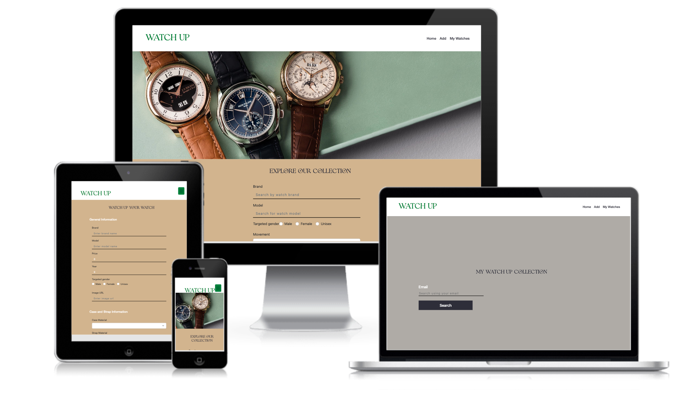
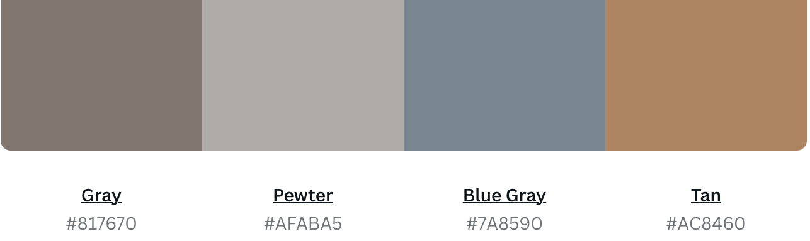
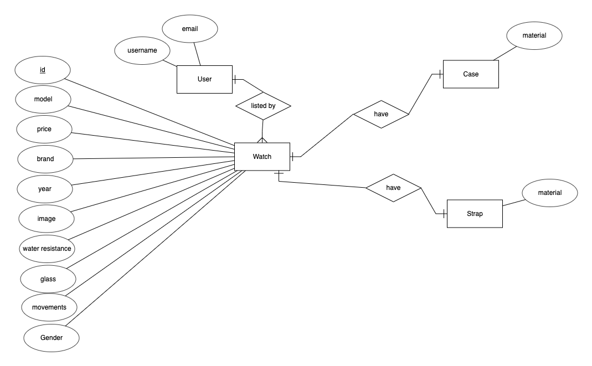

# **WATCH UP**

Link to demo : [WATCH UP](https://watch-up.netlify.app)

## Summary
We cannot image a time without watches. It might be widely argued that in today's context, handphone is used to tell time. However, watches continue to play an important role in our lives. Many enthusiasts all around the world collect watches of different designs, brands and workmanship. This website aims to bring these collectors together and share their collection to the world.

---
## UI/UX
### Strategy
### Organisational Goals
Every watch in the world is unique. The older the watch is, the more valuable it becomes. Although new watches can be found in many shops, the older watches are rare. It would be ideal if there an application for watch collectors to showcase their watches and also look at other's collections. Visitors of the website can search via brand, model, movement, gender and glass material from the collection. Watch collectors can add their watch to the collection as well. 

### User Goals
The users of WATCH UP are mostly veteran watch collectors, watch enthusiasts and watch buyers. The aim of the users is to be able to find and post watches to the collection. 
| User Stories | Accceptance Criteria |
| ----------- | ----------- |
| As a water collector, I want to show my collection to others and share my joy of collecting with watch colelctors. | A water collector can upload his watch details with a photo of his watch and he can edit the details as well. |
| As a water enthusiat, I like to view watch collections especially older watches and know what watches others have. | There is a criteria for watch collectors to upload the year the watch was released, so users will know the age of the watch. |
| As a water buyer, I wish to compare the price and also search from the collection via brand, model I am interested in. | Watches can be searched based on the model and brand. |

### Design Decisions

#### Color scheme

The color scheme chosen revolves around black, grey and tan. As watches are usually dull in colour, to put more focus on the watches rather than the bakcground, dull colours were used for the application. Green was only used for the title of the application to make it stand out and the color also complements the banner. 

#### Fonts

*Serif* is a font family used for apt giving the formal look for the watch. *Sans-serif* was mainly used to ensure that the words are clear when read in the forms. 

---

## Features

| Features | Description |
| ----------- | ----------- |
| Search from the watch collection | The users can search by brand, model, movement, glass material and gender. These features will help users to narrow down the collection and view more details of the watch they are intereted in. |
| Add watch to the watch collection | Users are able to add their watch to the watch collection by filling up the form. All the fields are required and error message will be prompted if the data is incorrect. |
| Update watch information | Users are able to search for their email and update their watch information. |
| Delete watch from the watch collection | Users are able to search for their email and delete their watch from the collection.|
---

### Structure and Skeleton

#### Database

Entity-Relationship Diagram (ERD) is drawn to demostrate the various relationships between entities for the website prior to modelling the database in MongoDB.

An Express server is set up and deployed to [render](https://www.render.com/), where API endpoints are accessible via the base URL at [https://project-2-watchup.onrender.com/](https://project-2-watchup.onrender.com/).

#### Wireframes
[Wireframes](./src/images/watchup_wireframe.pdf)

## Limitations and Future Implementations

1. Interaction between collector and user is limited
    - Current limitation : 
        - There is no platform for the users to add comments or post questions to the watch collector.
    - Future implementation : 
        - Review section can be added below the details so users can add comments and collectors can reply as well if a question is posted. 
2.  Connect to Home page 
    - Current limitation :
        - After delete, update and adding it remains in the same page. So the UI UX is affected. 
    - Future implementation :
        - After performing the action, the page should go to the home page.

3. Search page validation
    - Current limitation : 
        - Currently, if the user types a search that is not in the collection, nothing shows up.  
    - Future implementation :
        - Validation can be added to say that there is no search results for the selected search.
---

## Technologies Used

### Backend

1. Javascript

2. [Express](https://expressjs.com/)

3. [MongoDB Node Driver](https://www.mongodb.com/docs/drivers/node/current/)
    - To communicate with MongoDB database

4. [cors](https://www.npmjs.com/package/cors)
    - Middleware to enable Cross-Origin Resource Sharing (CORS)

5. [dotenv](https://www.npmjs.com/package/dotenv)
    - To allow loading of environment variables from .env file

6. [yup](https://www.npmjs.com/package/yup)
    - For validating the data
---

### Frontend

1. HTML

2. CSS

3. Javascript

4. [React](https://reactjs.org/)

5. [Bootstrap 5](https://getbootstrap.com/docs/5.0/getting-started/introduction/) 
    - Used for styling website

6. [React Bootstrap](https://react-bootstrap.github.io/)
    - Used for styling website

7. [Axios](https://github.com/axios/axios)
    - Used to communicate with Express server to create, read, update and delete data in database
---

## Testing

The website is tested for responsiveness using Developer Tools on Chrome browser for mobile, tablet and desktop screen widths.
The test cases can be found [here](./src/images/watch-up-test-cases.pdf).

---

## Deployment

### Frontend

The website is hosted using [Netlify](https://www.netlify.com/), deployed directly from the main branch of this Github repository.

### Backend

The Express server is hosted using [render](https://www.render.com/), deployed directly from the main branch of the Github repository [here](https://github.com/naushadbegum/Project_2_Watch).

---

## Credits and Acknowledgement
### Fonts :
1. [Dafont](https://www.dafont.com/) - Used for the romans story font displayed in website 
### Screenshot :
1. [CreateMockup.com](https://www.createmockup.com/generate/) - Used to generate responsive website mockup for README file
2. [Canva.com](https://www.canva.com/) -Used to generate the colour scheme and favicon logo for the project 
### Banner photo:
1. [Thewatchbox.com](https://www.thewatchbox.com/) -Used for the banner image of the home page
2. [Acollectedman](https://www.acollectedman.com/) -Used for the card images in the home, detail my watch pages
### Bootstrap Form :
1. [WesleyGithub](https://github.com/e0026557) -- used to create Bootstrap Form